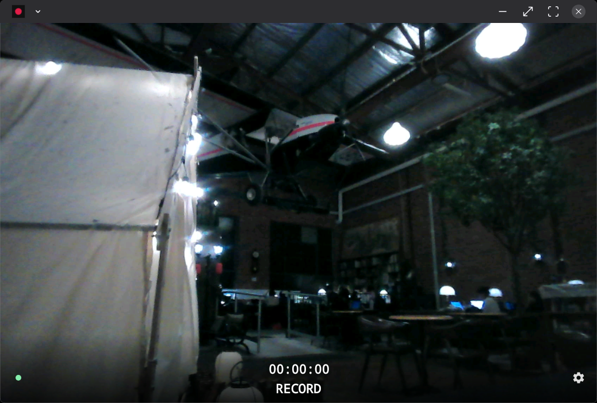
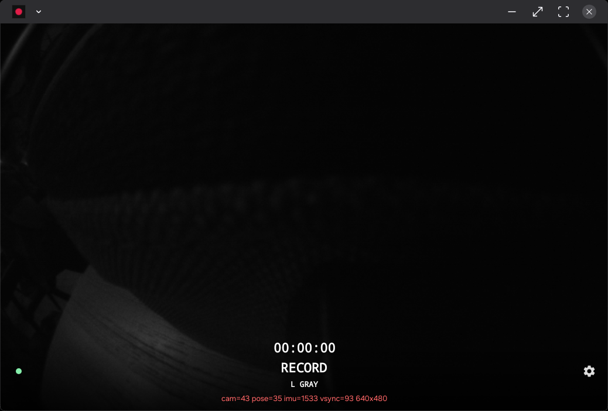
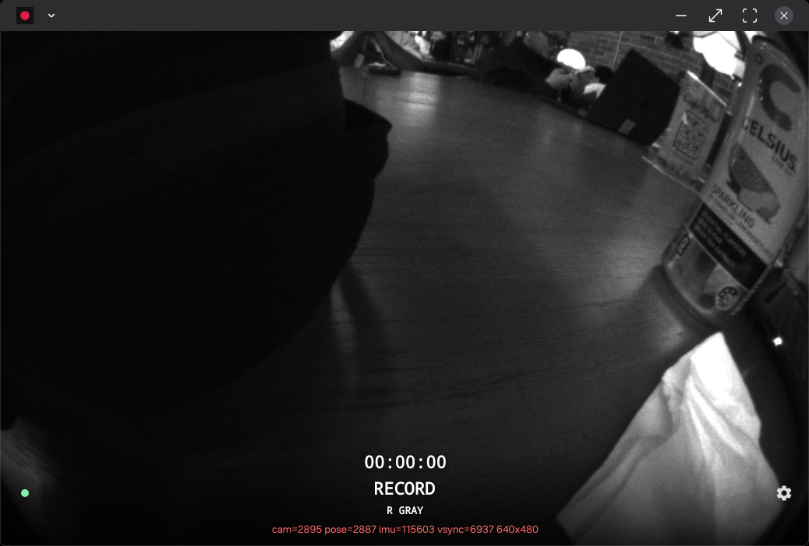
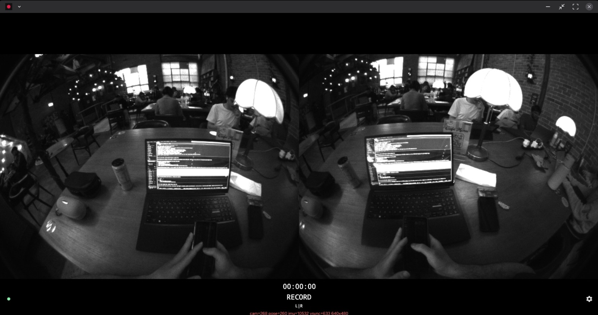

# XR field recorder (V1)

Package: `sh.colak.xrconsole.recorder`

Idle preview cycles four live views. Recording is still RGB + one mic.









V1 **records** only:

1. VITURE Luma Ultra **front RGB** camera — measured **2.07 MP / 1080p**,
   SDK MJPEG 1920×1080@30. Nothing higher is advertised.
2. One selected Android audio input, encoded as AAC 48 kHz mono

Idle **preview** also opens the two Carina grayscale **tracking** cameras on
glasses control USB `0x35CA:0x1104` (not UVC, not depth cameras): **L GRAY**,
**R GRAY**, or **L|R**. Measured **640×480** L0+R0 at ~25 Hz, with pose / IMU /
vsync on the same handle. They look more downward than RGB. Not muxed into the
RGB MP4.

On a grayscale preview, **SENSOR** starts a 30 s lossless session
(`Movies/XRConsole/Sensor/<stamp>/`: `metadata.json`, `camera.gray8`,
`camera.index.jsonl`, `pose.jsonl`, `imu.bin`, `vsync.jsonl`). Replay:
`console/recorder/sensor_replay.py <dir>`. Distinct from RGB **RECORD**.
Clocks and plane identity: `docs/carina-measurements.md`. Factory calib hunt:
`docs/carina-calibration.md`.

The microphone selector enumerates capture-capable Android inputs: built-in
mics, USB, wired headset, Bluetooth SCO/LE. Telephony RX, remote submix, and
other internal mix ports are omitted. Explicit choices persist by semantic
identity (device type, product name, and address), are resolved again when a
recording starts, and are verified against `AudioRecord.getRoutedDevice()`.
Requested and actual routes remain distinct in metadata. A missing explicit
device blocks recording; disconnecting it stops the active recording rather
than silently substituting another microphone.

Timestamps use one monotonic origin (`elapsedRealtimeNanos`) so later
streams can share the same clock.

The UI comes up even if the glasses path fails. Native RGB code loads when
the foreground preview starts, or when recording starts if preview is not
running. Carina native code loads only on a grayscale preview.

## Operation

Idle: edge-to-edge preview (foreground only) with overlay chrome — timer,
glasses status dot, gear, **RECORD**, and a camera-source label. Tap the
label to cycle **RGB → L GRAY → R GRAY → L|R**. Recording: **● REC**, timer,
**STOP**. RECORD is dimmed until an RGB camera is connected.

RGB uses `CENTER_CROP` (16:9 fill). Grayscale uses `FIT_CENTER` so stretching
the DeX window letterboxes both 4:3 eyes instead of clipping them. Timer /
glasses-dot / gear / RECORD|STOP sit on a bottom scrim. RECORD and STOP share
one text-sized hit box so the label swap does not jump. Backgrounding stops
the preview camera immediately; an in-progress recording keeps encoding
without updating the view. Hitting Record takes the USB RGB camera from
preview; idle preview can start again after stop.

A green status dot = RGB ready, dim = missing. Microphone choice lives under
the gear as a one-line settings popup. Requested vs routed mic still lands in
`session.json`; it is not shown on the idle screen.

The app does not register as a USB default handler. Connecting glasses
does not open a “choose an app for this USB device” prompt. Presence is
observed from the live USB device list. First grayscale open may still
request USB permission for the glasses control interface.

## RGB camera limits (measured)

This is a **2.07 MP / 1080p** camera as far as software can see. VITURE does
not publish a megapixel rating.

| | |
|---|---|
| USB | Sonix `vid=0x0C45 pid=0x636B`, product string `USB 2.0 Camera` |
| SDK stream | **MJPEG 1920×1080@30 only.** `xr_camera_provider_start` has no mode API. |
| UVC video max | MJPEG 1920×1080@30; also 1280×1024 / 960 / 720, 800×600, VGA and smaller at 5–30 fps |
| UVC uncompressed | YUY2 1920×1080@**5** fps; 1280×720@10 fps. Not useful for field capture. |
| UVC still-image max | 1920×1080 (same 2.07 MP). No higher still size. |
| Not advertised | nothing above 1080p, nothing above 30 fps, no 4K, no 60 fps |
| Bus | USB 2.0 High-Speed (isochronous max-packet 5120). Typical FHD webcam ceiling. |

`session.json` `camera_modes` records `sdk_stream`, every UVC video frame,
still sizes, and `max_megapixels`. Dual grayscale tracking cameras stay on
the VITURE control USB (`0x35CA:0x1104`) and are preview-only here (L GRAY /
R GRAY / L|R). They are not muxed into the recorded MP4. The RGB descriptor
set matches the SDK lock: MJPEG 1920×1080@30.

Foreground service types: `camera|microphone|connectedDevice`. Recording
survives UI background, fold, display off, DeX, Termux/Mosh. Notification
shows duration and a STOP action. Optional Quick Settings tile **XR REC**.

On fatal errors (glasses RGB gone, encoder death, mic death, storage
&lt; 500 MB) the current segment is finalized and the app stops in an
explicit error state. It does not keep writing corrupt media.

## Storage

Capture writes into app-specific storage so a crash still leaves a recoverable
source file:

```
Android/data/sh.colak.xrconsole.recorder/files/Movies/XRConsole/Recorder/<yyyyMMdd-HHmmss>/
  session.json
  events.jsonl
  <yyyyMMdd-HHmmss>_000.mp4
  ...
```

Each finalized segment is then published through MediaStore so Gallery can see
it:

```
Movies/XRConsole/Recorder/<yyyyMMdd-HHmmss>_NNN.mp4
```

Gallery indexes the MediaStore copy. The app-private file remains the
recoverable original. `session.json` records both `path` and `gallery_uri`.
`scripts/xrctl pull` uses `run-as` for the app-private path.

Segments default to **12 minutes**. Gap-minimized rollover keeps the
encoder running and starts the next MP4 on a keyframe.

## Permissions

Runtime (grant once): `CAMERA`, `RECORD_AUDIO`, `POST_NOTIFICATIONS`.

USB: permission is requested when the foreground preview or a recording
opens a USB device, not by registering as a USB default app. RGB is Sonix
`0x0C45:0x636B`. Grayscale is glasses control `0x35CA:0x1104` (first open
may prompt). Already-attached glasses are claimed from the live device list;
do not replug just because an attach callback was missed.

## Codec / bitrate

| | configured target |
|---|---|
| RGB input | VITURE SDK MJPEG ~1920×1080@30 |
| Video | hardware HEVC, fallback H.264, 12 Mbps |
| Audio | AAC-LC 48 kHz mono 128 kbps |

`session.json` records available inputs at start, selection mode, requested and
actual routed devices, route-match status, PCM sample count, peak and RMS, and
measured bitrate / MB-min / GB-hour / fps. `events.jsonl` records route changes.

Measured on the Fold with attached Luma Ultra, 2026-09-29:

- front RGB: **2.07 MP** capture (1920×1080). SDK MJPEG 1920×1080@30, hardware
  HEVC, 29.04–29.12 measured fps on the 35s run. UVC still-image max is also
  1080p. No higher mode exists on this unit.
- 35.3-second auto-route run: 1,020 frames in, 1,018 encoded, 1 dropped
- measured output: approximately 13.44 Mbps, 90.05 MB/min, 5.28 GB/hour
- two reduced-duration rollover segments independently contain HEVC + AAC
- Auto routed to `USB-Audio - VITURE Microphone`
- explicit VITURE USB mic matched the requested route and captured nonzero PCM,
  but its observed level was extremely low (peak 3, RMS 1.02)
- explicit Fold rear built-in mic matched and captured strong nonzero PCM
  (peak 32768, RMS 883.18)
- DJI Mic Mini enumerates as classic Bluetooth SCO. Preferred-device routing
  alone produced digital silence; modern communication routing was rejected;
  Samsung fallback SCO activation timed out. DJI validation remains open.

Manual STOP finalizes the current segment and publishes it to Gallery. Idle
resets the timer to `00:00:00`.

## Development

Proprietary VITURE `.so` / headers stay untracked. Build reuses the
UxSpace vendor tree:

```
VITURE_SDK_LIBS=$HOME/workspace/uxspace/Android/glasses/src/main/jniLibs
VITURE_SDK_INCLUDE=$HOME/workspace/uxspace/Android/SDK/linux-x86_64/include
```

```sh
console/recorder/build.sh
scripts/xrctl deploy console/recorder/build/outputs/apk/debug/xr-console-recorder-debug.apk \
  --package sh.colak.xrconsole.recorder
scripts/xrctl smoke sh.colak.xrconsole.recorder   # process-alive
console/recorder/smoke.sh                         # 30s record + ffprobe
```

Auto-record (agent smoke, no UI tap):

```sh
scripts/xrctl adb shell am start -n sh.colak.xrconsole.recorder/.MainActivity \
  -a sh.colak.xrconsole.recorder.SMOKE --ei duration_s 35 --ei segment_s 20
```

Never uninstall / `pm clear` to iterate. Stable package + debug
keystore + `adb install -r`.
